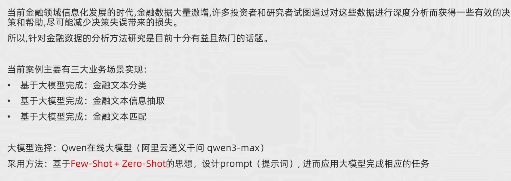
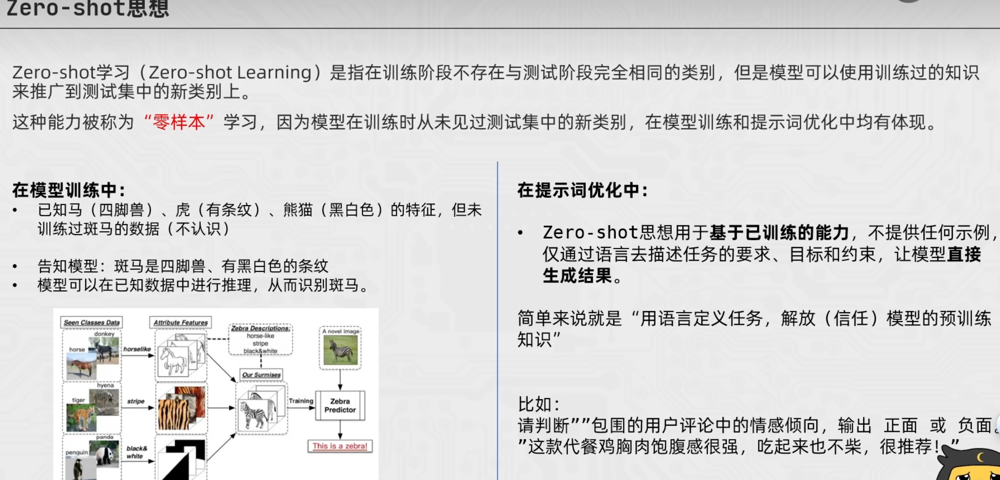
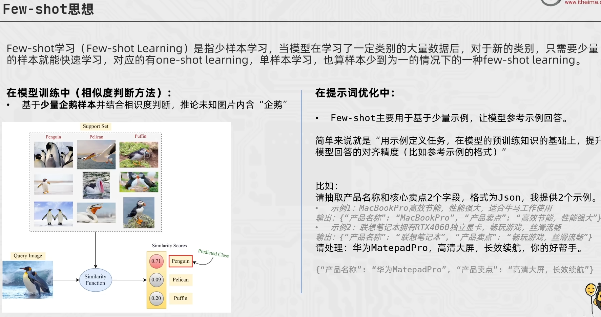

## 提示词工程的基本步骤
- 1.详细的描述
- 2.让模型充当某个角色
- 3.使用分隔符标明输入的不同部分，使用中括号，XML标签，三引号等分隔符可以帮助划分要区别对待的文本，可以帮助模型更好的理解文本内容。常用“”“把内容框起来。
- 4.对任务指定步骤：对于可以拆分的任务尽量拆开，最好能为其指定具体的步骤。
- 5.提供示例，先扔给大模型举例，然后让模型按照例子来输出。
- 6.基于文本文档，辅助大模型问答，降低模型“幻觉”问题。

## zero-shot and few-shot：

- Zero-shot：模型在未见过的任务上直接进行推理，不需要额外的训练或示例。
- Few-shot：模型在有限的示例下进行推理，通过学习示例中的模式和规则来完成任务。